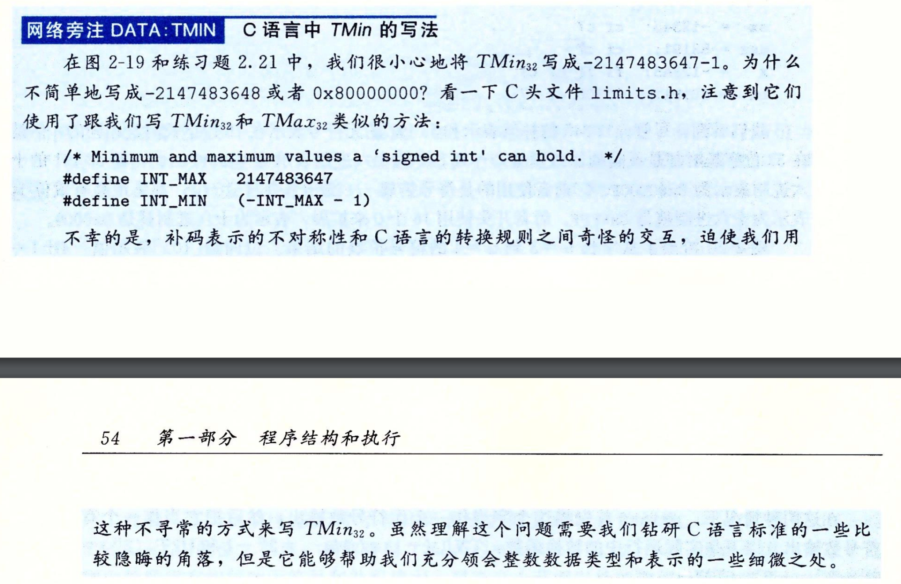

这段文字讨论的是为什么在 C 语言中表示最小的有符号整数值（`TMin`）时，需要使用 `-2147483647 - 1` 的方式，而不是简单地写成 `-2147483648` 或 `0x80000000`。

这个问题的核心在于 C 语言的整数表示和补码规则。具体原因如下：

1. **整数的表示问题**：
   在 C 语言中，整数通常使用补码表示。对于 32 位的有符号整数，`INT_MAX` 为 `2147483647`，`INT_MIN` 为 `-2147483648`。补码表示的规则是，最高位为符号位，1 表示负数，0 表示正数。

2. **溢出和常量处理**：
   如果你直接在代码中写 `-2147483648`，编译器会先解析 `2147483648` 这个值。然而，`2147483648` 超出了 32 位有符号整数的范围（`INT_MAX` 为 `2147483647`），因此这个值在编译时可能会被解释为无符号整数（`unsigned int`），这可能会导致溢出或错误的结果。

3. **补码的对称性**：
   由于补码表示中负数范围比正数多一个，因此 `INT_MIN`（即 `-2147483648`）在补码表示中没有对应的正数。这种不对称性使得 `-2147483648` 需要特殊处理，避免可能出现的编译器误解或不兼容性。

因此，通过使用 `-INT_MAX - 1` 的形式来表示 `INT_MIN`，可以确保整数范围在编译时不会出错，也符合 C 语言对补码表示的规则和处理方式。这种写法虽然不直观，但它能帮助开发者避免一些可能的隐患，特别是在跨平台或不同编译器下的兼容性问题。
