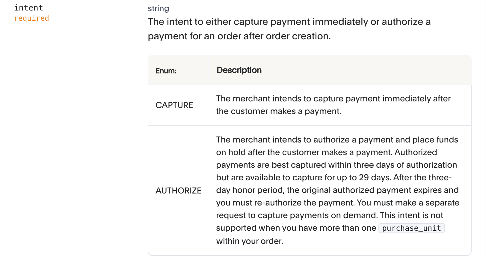
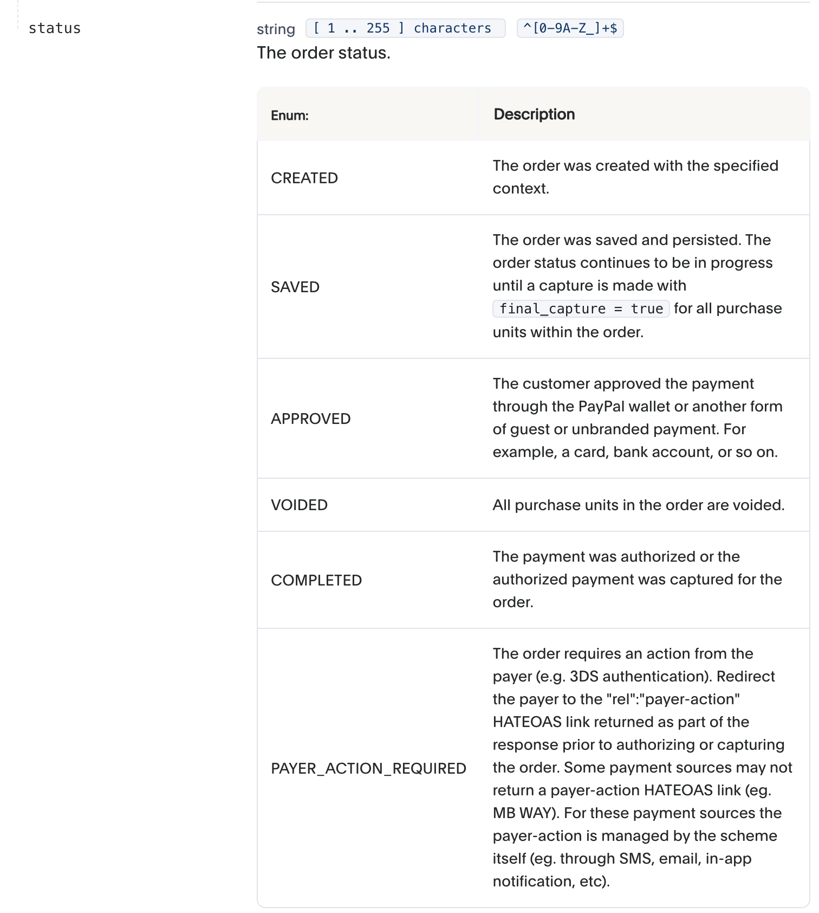
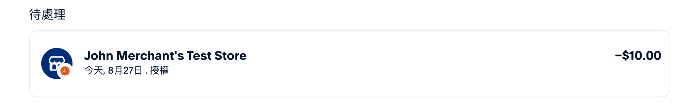

从[创建订单](https://developer.paypal.com/docs/api/orders/v2/#orders_create)接口说起

```
/v2/checkout/orders
```



`intent` 参数有两个选项：

0) `CAPTURE`：当用户同意付款之后，商户计划立即捕获这笔支付，也就是把钱从用户账户转移到商户账户。
1) `AUTHORIZE`：当用户同意付款之后，商户计划立即授权这笔支付，也就是把这笔钱先从用户账户中冻结，但是不转移到商户账户上。之后还需要手动调用 `/v2/payments/authorizations/{authorization_id}/capture` 接口捕获这笔支付。商户可以利用中间的这段时间来确认库存状态等操作。

我们再来看一下 Paypal 的订单状态设计


对于 `CAPTURE` 的情况

```
Create order
0) POST /v2/checkout/orders
"intent": "CAPTURE",
"status": "PAYER_ACTION_REQUIRED",

1) 用户点击付款
"intent": "CAPTURE",
"status": "APPROVED",

Capture payment for order
2) POST /v2/checkout/orders/:order_id/capture
"intent": "CAPTURE",
"status": "COMPLETED",
```

对于 `AUTHORIZE` 的情况

```
Create order
0) POST /v2/checkout/orders
"intent": "AUTHORIZE",
"status": "PAYER_ACTION_REQUIRED",

1) 用户点击付款
"intent": "AUTHORIZE",
"status": "APPROVED",

Authorize payment for order
2) POST /v2/checkout/orders/:order_id/authorize
"intent": "AUTHORIZE",
"status": "COMPLETED",

Capture authorized payment
3) POST /v2/payments/authorizations/:authorization_id/capture
"intent": "AUTHORIZE",
"status": "COMPLETED",
```

注意在完成 **`2) POST /v2/checkout/orders/:order_id/authorize`** 之后，并没有实际扣款，只是暂时把钱冻结了，还需要调用 `Capture authorized payment` 接口。

