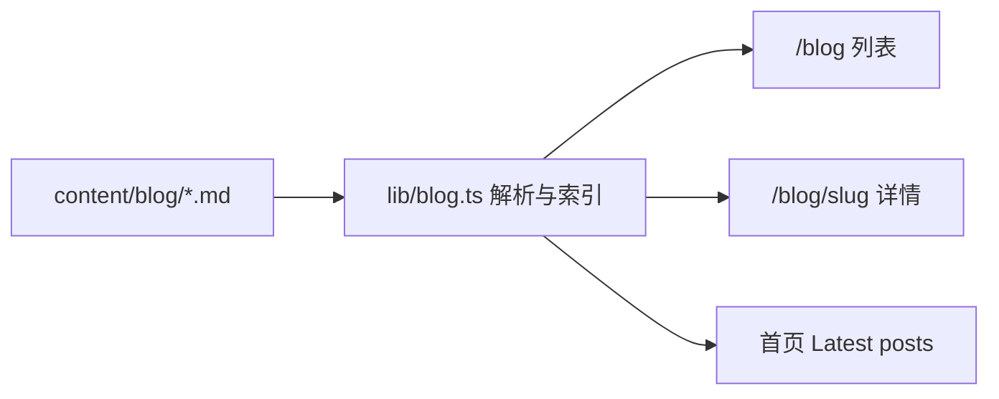

# 基于 Markdown 的博客模块技术方案

## 现状

- 技术栈：`package.json` 为 **Next.js 16.2**、React 19、Tailwind 4；已安装 `gray-matter`、`react-markdown`、`remark-gfm`、`@tailwindcss/typography`。
- 路由：`app/blog/page.tsx` 为文章列表；`app/blog/[slug]/page.tsx` 为详情；数据来自 `lib/blog.ts` 读取 `content/blog/*.md`。
- 首页 `app/components/home-blog-teaser.tsx` 由服务端传入最新文章摘要。

目标：**以 `.md` + frontmatter 为唯一事实来源**，便于从旧 Astro 站点「复制文件 + 微调 frontmatter」完成迁移。

---

## 依赖安装（pnpm）

必装：

```bash
pnpm add gray-matter react-markdown remark-gfm
```

可选（Tailwind Typography，用于 `prose` 文章排版）：

```bash
pnpm add -D @tailwindcss/typography
```

---

## 推荐架构（与 Astro 最接近）



| 层次 | 选择 | 说明 |
|------|------|------|
| 存放 | `content/blog/*.md` | 与常见 Astro `src/content/blog` 同级概念；迁移时整目录拷入即可。 |
| 元数据 | YAML frontmatter | 见下文「与 Astro 导出格式对齐」。 |
| 解析 | `gray-matter` + Node `fs` | 仅在服务端 `lib/blog.ts` 中读取，**不向客户端暴露磁盘路径**。 |
| 正文 | `react-markdown` + `remark-gfm` | 纯 Markdown + GFM；若未来要在文中嵌 React 组件再考虑 MDX。 |
| 路由 | `app/blog/[slug]/page.tsx` | `generateStaticParams`、`generateMetadata`。 |

**为何不优先选 `@next/mdx` 按文件生成路由**：更贴近「一堆 md 文件 + 统一模板」，与 Astro content collections 心智一致。

**可选增强（按需加）**

- 代码高亮：`rehype-pretty-code` 或 Shiki。
- RSS：`app/rss.xml/route.ts` 用同一套 `getAllPosts()` 输出 XML。

---

## 与 Astro 导出格式对齐（本项目已适配）

从旧 Astro 博客直接拷入的 frontmatter 可在解析层归一，**不必批量改每篇文章**。

| 常见 Astro 字段 | 处理方式 |
|-----------------|----------|
| `title` | 直接使用 |
| `pubDatetime` / `pubDate` / `date` | 统一解析为 `Date`，列表排序与展示用 ISO 日期字符串 |
| `description` | 摘要；亦作 `excerpt` |
| `draft` | `true` 时构建与列表均排除 |
| `tags` | 字符串数组，可展示在文首或后续扩展 |
| `author` | 可选，文首展示 |
| `featured` | 可选，预留 |
| `ogImage` | 非空时写入 `openGraph.images` |
| `postSlug` | **非空**时作为 URL slug；**空字符串**时与未设置一样，**由源文件名**（去 `.md`）经 slugify 得到 slug（小写、非字母数字变 `-`） |

**图片（与 `./xxx.png` 相对路径）**

- Markdown 中 `` 在浏览器中会按**页面 URL** 解析，无法直接指向 `content/blog/`。
- 实现方式：`app/blog-media/[filename]/route.ts` 在**校验文件名安全**（禁止 `..`、路径分隔符）后，从 `content/blog/` 读取对应文件并返回正确 `Content-Type`。
- 限制：同一目录下若两篇文使用**同名**图片文件名会冲突，需改名或改为子目录方案（后续可扩展）。

---

## 与旧 Astro 博客的迁移关系

1. **文件**：把 Astro 里 posts 目录下的 `.md` 拷到 `content/blog/`。
2. **Frontmatter**：依赖 `lib/blog.ts` 内字段映射，见上表。
3. **资源**：与 md 同目录的静态文件通过 `/blog-media/{filename}` 提供；新文章也可改为 `public/` 下绝对路径。

---

## 实现要点（代码位置）

- **`lib/blog.ts`**：`getAllPosts`、`getPostBySlug`、`getLatestPosts(n)`；draft 过滤；按日期降序。
- **`app/blog-media/[filename]/route.ts`**：受控读取 `content/blog` 内媒体文件。
- **`app/blog/[slug]/page.tsx`**：`ReactMarkdown` + 自定义 `img` 将相对路径转为 `/blog-media/...`；`prose` 排版。
- **首页**：`app/page.tsx` 调用 `getLatestPosts(2)`，将结果以 props 传给 `HomeBlogTeaser`（避免在客户端 `fs`）。

---

## 风险与注意点

- **Next 16**：以当前 `node_modules/next` 为准（如 `params` 为 `Promise`）。
- **草稿**：`draft: true` 不参与 `generateStaticParams`。

---

## 小结

采用 **`content/blog/*.md` + gray-matter + react-markdown** + **blog-media 路由** 覆盖 Astro 迁移场景；列表、详情、首页共用 `lib/blog.ts`。
